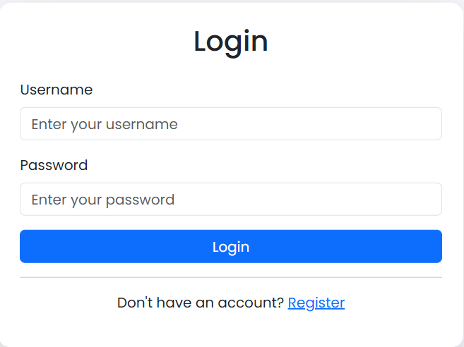
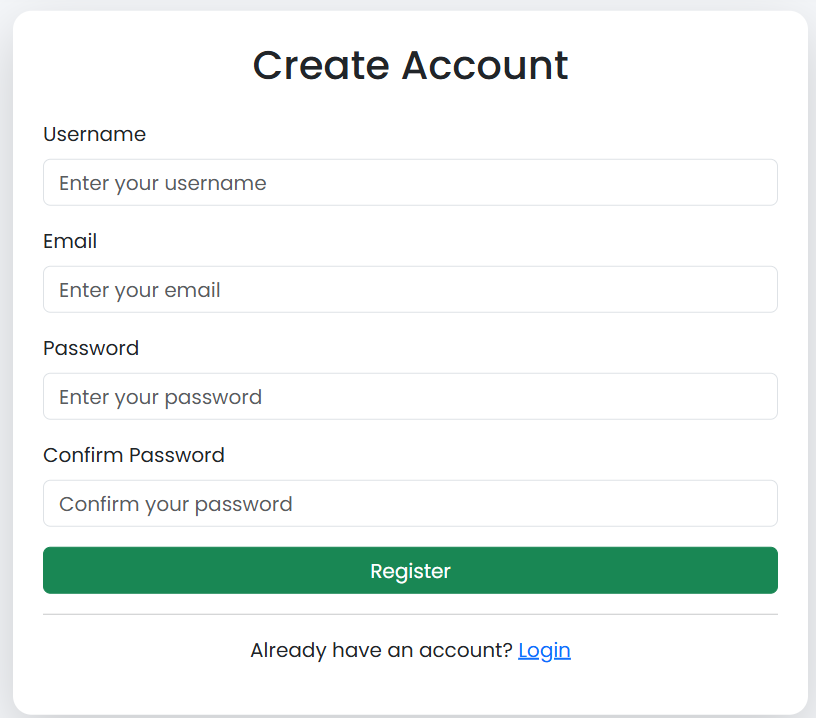
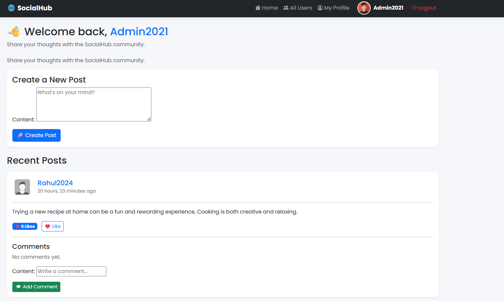
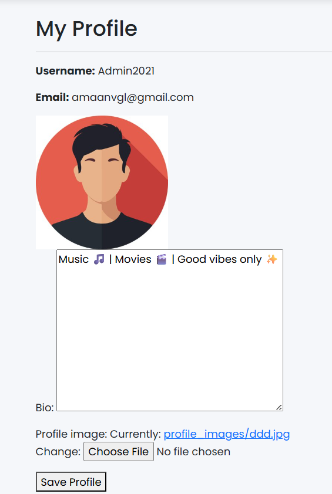
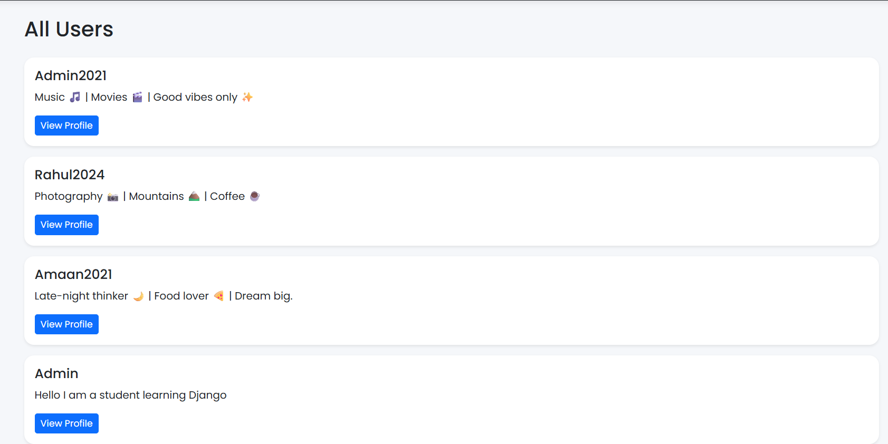

# SocialHub

A modern social media web application built using **Python**, **Django**, **SQLite**, and **Bootstrap**. Users can register, log in, create posts, like posts, comment, follow other users, and manage their profiles.

---

## Features

- User Registration
- User Login & Logout
- User Profile
- Upload Profile Picture
- Update Bio
- Create Posts
- Delete Own Posts
- Like / Unlike Posts
- Comment on Posts
- Follow / Unfollow Users
- View Other User Profiles
- View All Registered Users
- Responsive Bootstrap User Interface
- Django Admin Panel

---

## Technologies Used

- Python
- Django
- SQLite
- HTML
- CSS
- Bootstrap 5

---

## Project Structure

```
SocialHub/
│
├── accounts/
├── posts/
├── config/
├── templates/
├── media/
├── screenshots/
├── requirements.txt
├── manage.py
├── README.md
└── db.sqlite3
```

---

## Installation

### 1. Clone the repository

```bash
git clone https://github.com/amaanvg/SocialHub.git
```

### 2. Open the project

```bash
cd SocialHub
```

### 3. Create a virtual environment

```bash
python -m venv venv
```

### 4. Activate the virtual environment

#### Windows

```bash
venv\Scripts\activate
```

#### Linux / macOS

```bash
source venv/bin/activate
```

### 5. Install dependencies

```bash
pip install -r requirements.txt
```

### 6. Run migrations

```bash
python manage.py migrate
```

### 7. Start the development server

```bash
python manage.py runserver
```

Open your browser and visit:

```
http://127.0.0.1:8000/
```

---

# Screenshots

## Login Page



---

## Register Page



---

## Home Feed



---

## My Profile



---

## All Users



---

## Main Functionalities

### Authentication

- User Registration
- User Login
- User Logout

### User Profile

- Upload Profile Picture
- Update Bio
- View Other Users

### Social Features

- Create Posts
- Delete Posts
- Like / Unlike Posts
- Add Comments
- Follow / Unfollow Users

---

## Future Improvements

- Edit Posts
- Search Users
- Notifications
- Dark Mode
- Direct Messaging
- Image Posts
- Real-time Chat
- Password Reset via Email

---

## Author

**Mohammad Amaan**

GitHub: https://github.com/amaanvg

---

## License

This project is created for educational purposes and personal portfolio use.
